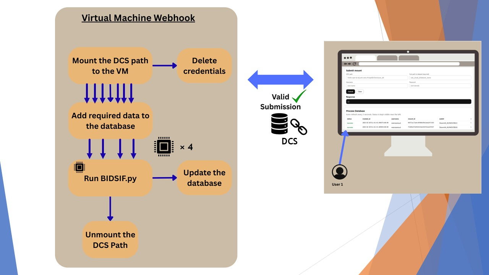
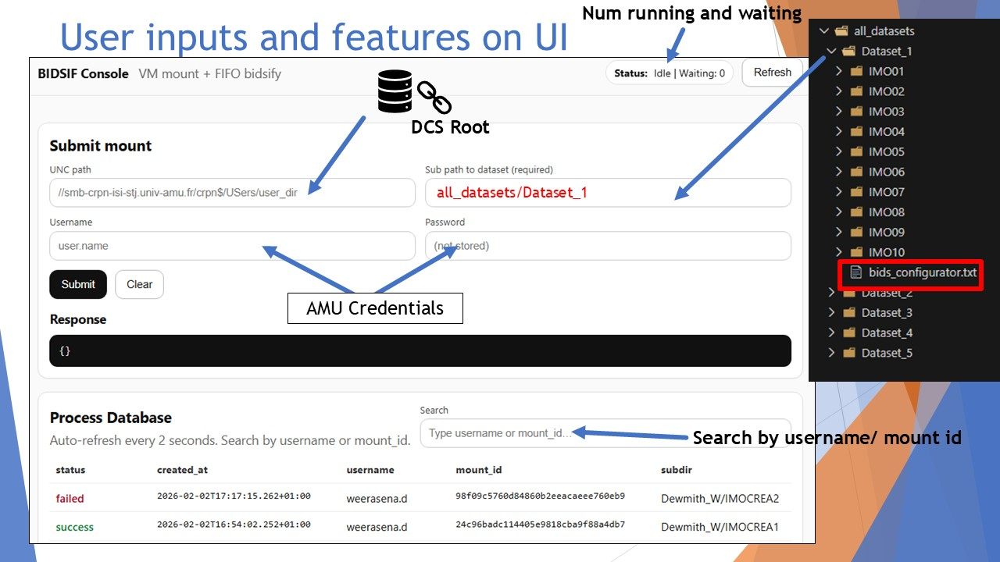

# BIDSIF_VM

## Introduction

**BIDSIF_VM** is a virtual-machine–based web interface designed to simplify and standardize the conversion of neuroimaging datasets into the **BIDS (Brain Imaging Data Structure)** format.

It provides a lightweight, reproducible environment where users can:
- Configure their dataset using a simple text-based configurator
- Launch a local web interface to connect to the web API of the Virtual Machine.
- Add the dataset path to be BIDSified.
- Run the BIDS conversion algorthmn within the VM and store the BIDSIFied dataset in your DCS storage.

The goal of BIDSIF_VM is to lower the technical barrier to BIDS conversion by providing:
- A preconfigured Python environment on a VM with all necessary dependencies for BIDS conversion.
- The same environment for all users, ensuring consistency and reproducibility without worrying about local setup issues.

This README walks you step by step through connecting to the VM, setting up the environment if needed, launching the API, and accessing the interface from your local machine.

## How BIDSIF_VM Works

The diagram below illustrates the overall workflow of **BIDSIF_VM**, from user interaction to dataset processing inside the Virtual Machine.

<p align="center">
  
</p>

### Overview

The diagram above shows how **BIDSIF_VM** processes from start to finish with multiple submissions. The workflow is as follows:

1. A user interacts with the web interface from their local machine and submits a dataset request.
2. The request is sent to the Virtual Machine through the web API and validated.
3. The VM temporarily mounts the requested DCS path using the provided credentials.
4. Required metadata and job information are stored in an internal database.
5. The BIDS conversion process (`BIDSIF.py`) is executed inside the VM in a controlled and standardized environment.
   - Multiple worker processes can handle jobs sequentially to ensure stability.
6. During processing, the database is updated with the job status (running, success, or failure).
7. Once processing is complete, the dataset is unmounted from the VM.
8. User credentials are discarded, and only user-visible references and results remain accessible through the web interface.

This workflow ensures:
- Secure handling of credentials
- No permanent mounting of user data
- Reproducible and isolated BIDS conversion
- Clear tracking of processing jobs through the UI

## Step 1 

Make sure you are successfully connected to the vm through SSH and that you are in the directory `/home/crpn
`. 

Verify by typing in `pwd` on the terminal.

> ## 🚨 **Important:**  
> If you are logging into the VM only to **check whether the application is running**, **stop it**, or **view logs**, you do **not** need to start the API manually.  
> Please refer to the section **[Additional Feature: Automatic API Startup on VM Boot](#additional-feature-automatic-api-startup-on-vm-boot)** for instructions.
  
## Step 2 : Get into the `bidsif_vm` directory.

```bash
cd /home/crpn/GITLAB/bidsif_vm
```
<details>
<summary><h2>Expand and follow the instructions if the virtual env is not set</h2></summary>

## Step 2.1 : Create the Virtual environment using UV

```bash
uv venv .bidsif_vm_venv --python 3.10.0
```

## Step 2.2 : Install the dependencies
```bash
uv pip install -r requirements.txt --python .bidsif_vm_venv
```

</details>

## Step 3 : Configure the converter package path (JSON)

This project now reads converter paths from:

```bash
converter_package.json
```

Default file content:

```json
{
  "package_dir": "../bidsif",
  "script_path": "bidsify.py",
  "python_path": ".venv_bidsif/bin/python"
}
```

Meaning:
- `package_dir`: folder containing the conversion package
- `script_path`: converter script (absolute or relative to `package_dir`)
- `python_path`: virtualenv python (absolute or relative to `package_dir`)

Optional: point to another config file with:

```bash
export BIDSIF_PACKAGE_CONFIG=/absolute/path/to/your_converter_package.json
```

## Step 4 : Activate the virtual environment.

```bash
source .bidsif_vm_venv/bin/activate
```

## Step 5 : Run the web interface API.

```bash
uvicorn main:app --host 0.0.0.0 --port 8000
```

## Step 6 : Connect to the web interface from your local machine.

Open your browser and go to http://10.184.12.152:8000

## Step 7 : User Interface Instructions

The screenshot below explains how to fill in the fields in the BIDSIF_VM web interface.



Once the the datset is processed and the BIDS conversion is successful, you will find the BIDSified dataset in your DCS storage at the path you specified in the `reference output path` field of the database interface.

Important note: It is required to have the ```bids_configurator.txt``` filled and placed in your dataset folder for the bidsification process to work. This file contains the necessary information for the BIDS conversion algorithm to correctly convert your dataset into BIDS format.

### Follow [BIDSIF repo](https://gitlab.crpn.univ-amu.fr/di-s-c/bidsif) for instructions on filling in the ```bids_configurator.txt```


---

## Additional Feature: Automatic API Startup on VM Boot

To improve usability and reliability, the BIDSIF_VM API is configured to **start automatically when the VM boots**, without requiring a user to manually activate the virtual environment or run the server command.

This is implemented using a **systemd service**, which is the standard service manager on Linux systems.

### What this provides
- The API starts automatically when the VM starts
- The service restarts automatically if it crashes
- No SSH session is required to keep the API running
- Logs are centralized and persistent

---

### How the automatic startup is implemented

A systemd service file is installed at:

```bash
/etc/systemd/system/bidsif.service
```

This service directly runs `uvicorn` from the project’s virtual environment:

```ini
[Unit]
Description=BIDSIF VM FastAPI Server
After=network.target

[Service]
Type=simple
User=crpn
WorkingDirectory=/home/crpn/GITLAB/bidsif_vm
ExecStart=/home/crpn/GITLAB/bidsif_vm/.bidsif_vm_venv/bin/uvicorn main:app --host 0.0.0.0 --port 8000
Restart=always
RestartSec=3
Environment=PYTHONUNBUFFERED=1

[Install]
WantedBy=multi-user.target
```

---

### How to check if the API is running

```bash
systemctl status bidsif
```

If the service is running, you should see:

```
Active: active (running)
```

Then open your browser and go to http://10.184.12.152:8000

---

### How to view API logs

```bash
journalctl -u bidsif -f
```

---

### How to start, stop, or restart the service manually

Start the service:
```bash
sudo systemctl start bidsif
```

Stop the service:
```bash
sudo systemctl stop bidsif
```

Restart the service:
```bash
sudo systemctl restart bidsif
```

---

### How to enable or disable automatic startup

Enable automatic startup (default):
```bash
sudo systemctl enable bidsif
```

Disable automatic startup:
```bash
sudo systemctl disable bidsif
```

---

### Summary

With this setup, the BIDSIF_VM API behaves like a standard system service:
- It starts automatically on boot
- It does not depend on user sessions
- It can be monitored and controlled in a predictable way

This ensures a stable and reproducible environment for all users of the VM.

## License

BIDSIF_VM is open-source software licensed under the
[GNU General Public License version 3.0 only](LICENSE) (`GPL-3.0-only`).

Third-party components and the separately distributed BIDSIF converter remain
subject to their respective license terms.
